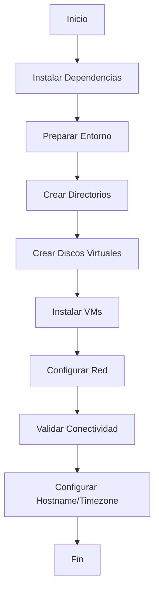

# Documentación de Automatización de Máquinas Virtuales

## Overview

El proyecto implementa una automatización completa para la creación y gestión de máquinas virtuales utilizando libvirt/KVM sobre sistemas Debian. Esta solución permite desplegar infraestructura de manera consistente y replicable.

## Playbooks Principales

### 02_create_virtual_machines_from_iso.yml

**Propósito**: Orquestar la creación completa de máquinas virtuales desde una ISO personalizada.

**Características**:
- Control de ejecución mediante variables condicionales
- Integración con playbook de configuración posterior
- Ejecución secuencial de roles especializados

**Variables Clave**:
```yaml
skip_build_vm: false  # Permite omitir la creación de VMs
```

**Flujo de Ejecución**:
1. `install_common_host_packages` - Instala dependencias
2. `vm_box/prepare_vm_environment` - Prepara el entorno
3. `vm_box/build_virtual_machines` - Crea las VMs
4. `vm_box/initialize_vm_networking` - Configura red
5. `03_configure_vm_hostname_timezone_and_services.yml` - Configuración post-creación

## Roles Especializados

### vm_box/prepare_vm_environment

**Responsabilidades**:
- Instalación de paquetes de virtualización
- Configuración de libvirt
- Preparación de redes virtuales
- Validación de requisitos del sistema

**Dependencias Críticas**:
- qemu-kvm
- libvirt-daemon-system
- virtinst
- bridge-utils

### vm_box/build_virtual_machines

**Funcionalidades Principales**:

#### 1. Gestión de Almacenamiento
```yaml
- name: crear directorio de almacenamiento de las vm's
  ansible.builtin.file:
    path: "{{ parent_folder }}/storage"
    state: directory
    owner: "{{ ansible_user }}"
    group: "{{ ansible_user }}"
    mode: "0755"
```

#### 2. Creación de Discos Virtuales
```bash
qemu-img create -f qcow2 {{ item.name }}.qcow2 {{item.disk_size}}G
```

**Características**:
- Formato qcow2 para optimización de espacio
- Tamaño configurable por VM
- Detección de discos existentes (idempotencia)

#### 3. Despliegue de Máquinas Virtuales
```bash
virt-install \
   --name "{{ item.name }}" \
   --ram  {{ item.memory }} \
   --vcpus {{ item.cpus }} \
   --cpu host \
   --disk path="{{storage_path}}/{{item.name}}".qcow2,format=qcow2,size=20 \
   --cdrom {{iso_out}} \
   --network network=default,mac={{item.mac1}} \
   --graphics none \
   --console pty,target_type=serial \
   --os-variant {{os_variant}} \
   --boot cdrom,hd \
   --noautoconsole \
   --noreboot
```

**Parámetros Configurables**:
- **Nombre**: Identificador único de la VM
- **Memoria**: RAM asignada (configurable por VM)
- **CPUs**: Núcleos de procesador
- **Almacenamiento**: Tamaño del disco virtual
- **Red**: Configuración MAC y red virtual
- **SO**: Variante de sistema operativo

### vm_box/initialize_vm_networking

**Responsabilidades**:
- Configuración de red DHCP
- Validación de conectividad
- Configuración de DNS
- Pruebas de conectividad de red

## Configuración de VMs

### Variables de Configuración

Las VMs se definen mediante la variable `vm_list` en el inventario:

```yaml
vm_list:
  - name: k8s-master
    memory: 4096
    cpus: 2
    disk_size: 40
    mac1: 52:54:00:12:34:56
  - name: k8s-worker
    memory: 4096
    cpus: 2
    disk_size: 40
    mac1: 52:54:00:12:34:57
```

### Requisitos del Sistema

#### Host de Virtualización
- **CPU**: Soporte de virtualización (Intel VT-x/AMD-V)
- **RAM**: Mínimo 8GB (2GB por VM + 4GB host)
- **Almacenamiento**: 100GB libres para VMs
- **SO**: Linux con KVM

#### Software Requerido
- qemu-kvm (>= 6.0)
- libvirt (>= 7.0)
- virtinst (>= 3.0)
- bridge-utils

## Características Avanzadas

### Idempotencia
- Detección de VMs existentes
- No recreación de discos virtuales
- Validación de estados previos

### Flexibilidad
- Configuración parametrizada
- Soporte para múltiples perfiles de VM
- Integración con ISO personalizadas

### Monitoreo
- Logs de creación detallados
- Validación de estados post-creación
- Detección de errores de configuración

## Flujo Completo de Automatización



## Mejores Prácticas

### Seguridad
- Aislamiento de redes virtuales
- Configuración de MAC addresses fijas
- Restricción de permisos de archivos

### Rendimiento
- Uso de formato qcow2
- Asignación optimizada de recursos
- Configuración de CPU host

### Mantenimiento
- Documentación de configuraciones
- Versionado de plantillas
- Monitoreo de recursos

## Troubleshooting Común

### Problemas de Virtualización
```bash
# Verificar soporte de virtualización
egrep -c '(vmx|svm)' /proc/cpuinfo

# Validar módulos KVM
lsmod | grep kvm
```

### Problemas de Red
```bash
# Verificar estado de libvirt
systemctl status libvirtd

# Listar redes virtuales
virsh net-list --all
```

### Problemas de Permisos
```bash
# Añadir usuario a grupos necesarios
usermod -aG libvirt,kvm $USER
```

## Integración con Otros Componentes

Esta automatización se integra con:
- **ISO Personalizada**: Utiliza la ISO generada en el paso anterior
- **Configuración de VMs**: Se conecta con el playbook de configuración
- **Cluster Kubernetes**: Prepara las VMs para MicroK8s
- **Networking**: Configura red para comunicación entre nodos

---

*Esta automatización reduce el tiempo de despliegue de infraestructura de horas a minutos, garantizando consistencia y replicabilidad.*